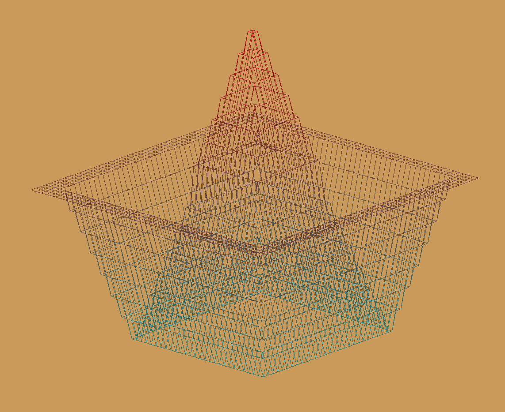
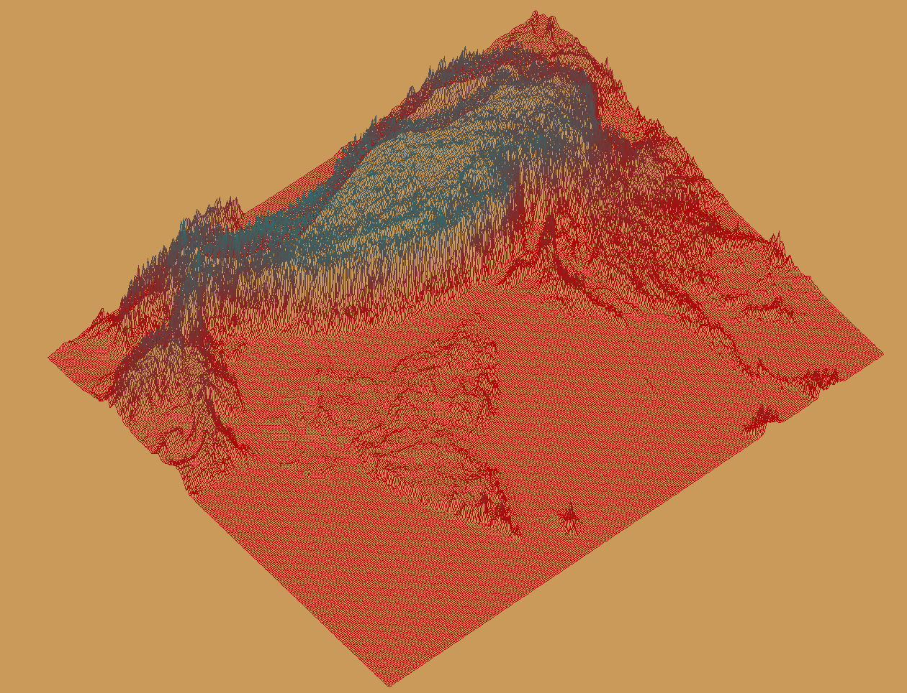

## 📌 Overview

Fdf is a simple renderer of contour map.

## 🌟 Features
- **Map support**: Read height maps from text files with height values
- **3D projection**: Isometric and dimetric projection modes
- **Wireframe rendering**: Connected points creating mesh structure
- **Height visualization**: Color gradients based on elevation changes
- **Interactive controls**: Zoom in/out, translate, rotate the model and scale height
- **Error handling**: Robust parsing for malformed map files


## ▶️ Run

### Compilation
```bash
git clone https://github.com/vallucodes/fdf.git
cd fdf
make
```
### Run
```bash
./fdf maps/42.fdf
```

## 🕹️ Controls

### 📺 **View Controls**
- `C` - Reset view
- `1` - Isometric view
- `2` - Dimetric view

### 🧭 **Navigation**
- `Scroll` - Zoom in/out
- `Arrow Keys` - Move around

### 🎛️ **Transformations**
- `SHIFT/CTRL + J` - Scale Z-axis
- `SHIFT/CTRL + X` - Rotate around X-axis
- `SHIFT/CTRL + Y` - Rotate around Y-axis
- `SHIFT/CTRL + Z` - Rotate around Z-axis

### 🚪 **Window**
- `ESC` - Close window

| Component | Details |
|-----|----------|
| Graphics Library | MLX42 integration for window creation, hooks, and pixel rendering |
| File Parser | Custom file parser for `.fdf` files with coordinate validation and error handling |
| 3D Mathematics | Matrix operations for rotation, scaling, and translation transformations |
| Projections | Isometric and dimetric projection algorithms converting 3D points to 2D screen view |
| Wireframe Renderer | Line drawing algorithms using Bresenham's algorithm for connecting mesh vertices |
| Colors | Height-based color gradients with linear interpolation between elevation levels |
| Hooks | Keyboard and mouse hooks using MLX hooks for real-time interaction |
| Library Integration | Custom `libft` library usage for string manipulation and utility functions |

## 📸 Images




